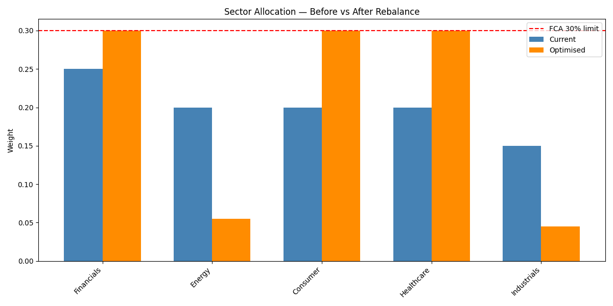
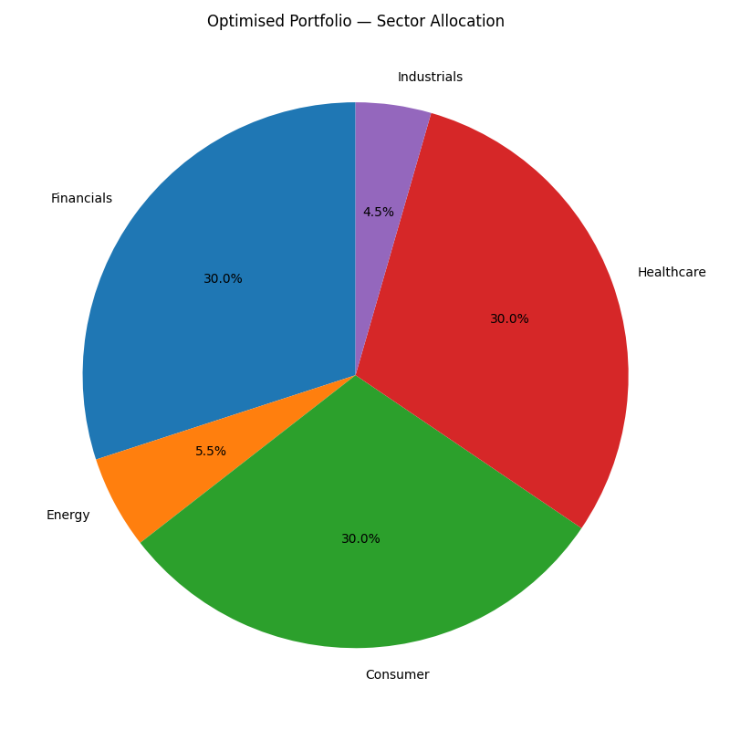

# FTSE 100 Portfolio Rebalancer
Ridge-regularised FTSE 100 portfolio rebalancing with FCA compliance


## Results

| Metric | Value |
|--------|-------|
| Condition number improvement | k reduced from 2,862 to 62.7 (46x) |
| FCA compliance | PASS — 0 violations |
| Trades generated | 100 |
| Transaction cost | GBP99,814 (0.25%) |
| Tests passing | 19 |

## Portfolio Visualisation

The charts illustrate sector allocation before and after optimisation. The initial 
portfolio shows a relatively balanced distribution, while the optimised portfolio 
reallocates weights to maximise exposure within regulatory constraints.

Post-optimisation, Financials, Consumer and Healthcare are pushed to the 30% FCA 
limit, while Energy and Industrials are significantly reduced. This demonstrates how 
the model concentrates capital into stronger signals while enforcing diversification 
constraints.




## Problem Statement

FTSE 100 returns data is severely ill-conditioned — k(X'X) = 2,862 — due to 
within-sector correlation where stocks in the same industry exhibit near-linear 
dependence. Under these conditions, direct OLS via (X'X)^-1 X'y produces 
non-physical portfolio weights with magnitudes of +1000 or -1000, implying 
excessive leverage or unintended short positions.

This directly violates FCA regulations:
- No single equity position above 10%
- No sector allocation above 30%
- Minimum 5% in liquid assets

Direct OLS is therefore unsuitable for portfolio construction in correlated equity 
universes — regularisation is required to obtain stable, compliant weights.

## Solution Approach

Ridge regression replaces the OLS system with
(X'X+lambda * I)w=X'y, adding lambda * I to lift the eigenvalues and reduce the condition number by approximately 46x. The regularisation parameter lambda is selected via 5-fold cross-validation.

FCA constraints are enforced using an iterative projection method. For version 1, this was a deliberate proof-of-concept decision, prioritising speed and reasonable results over optimality. A constrained quadratic programming (QP) formulation is identified as future work.

## Installation
```
git clone https://github.com/LukeWardle/ftse-portfolio-rebalancer
cd ftse-portfolio-rebalancer
python -m venv venv
venv\Scripts\activate
pip install -r requirements.txt
```

## Usage
```
python main.py        # runs full pipeline, prints FCA compliance and volatility
pytest tests/ -v      # runs 19 tests
```

## Project Structure

See DESIGN.md for full architecture and function signatures.

```
  ftse100_portfolio_rebalancer/
  |-- src/
  |    |-- data.py                                
  |    |-- ridge.py                                    
  |    |-- constraints.py 
  |    |-- rebalance.py 
  |    |__ analysis.py
  |-- data/
  |-- tests/
  |-- results/ 
  |-- images/                                                               
  |-- main.py                                                                 
  |-- verify_multicollinearity.py                                             
  |-- export_results.py                                                
  |-- visualise_portfolio.py                                                  
  |-- DESIGN.md
  |-- README.md
  |-- .gitignore
  |__ requirements.txt
  ```

## Future Work

- Upgrade data source to yfinance for real FTSE returns
- Upgrade solver to constrained QP (scipy SLSQP) for v2
- ILP upgrade for integer trade sizing
- Volatility comparison meaningful only with real returns data — synthetic data limitation

## Licence

MIT